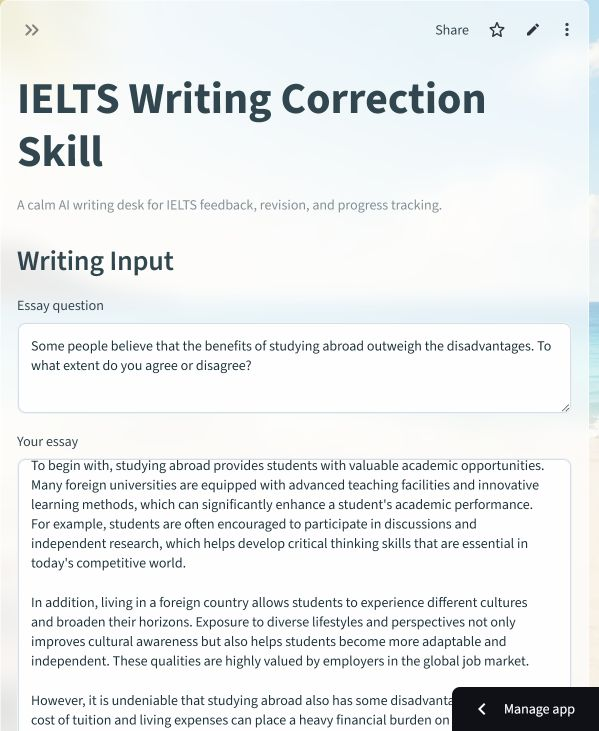
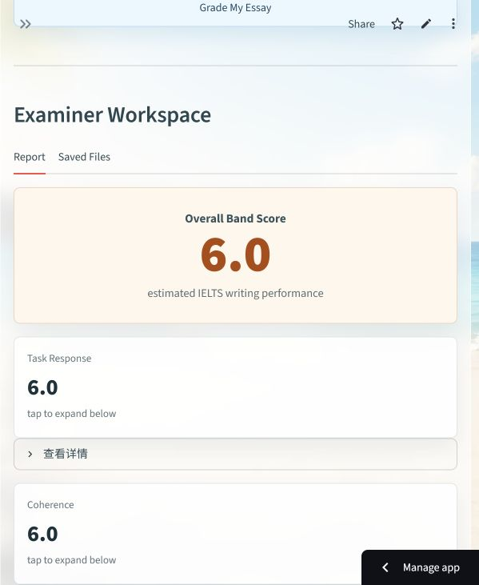
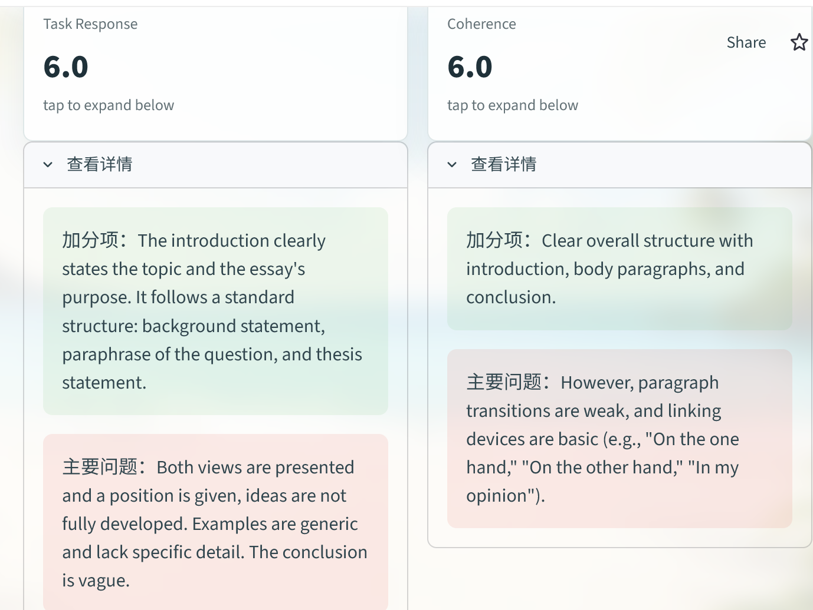
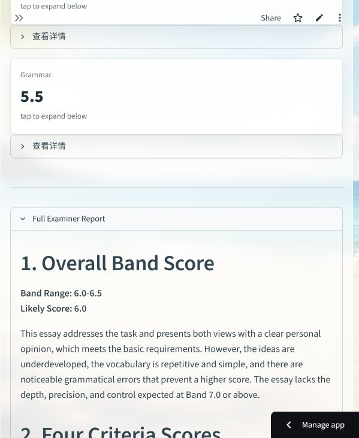
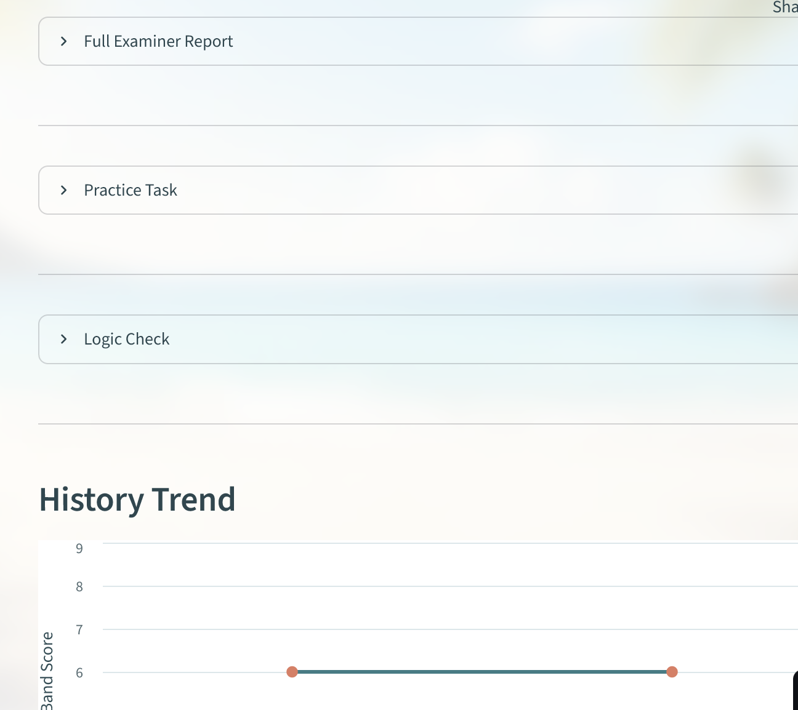
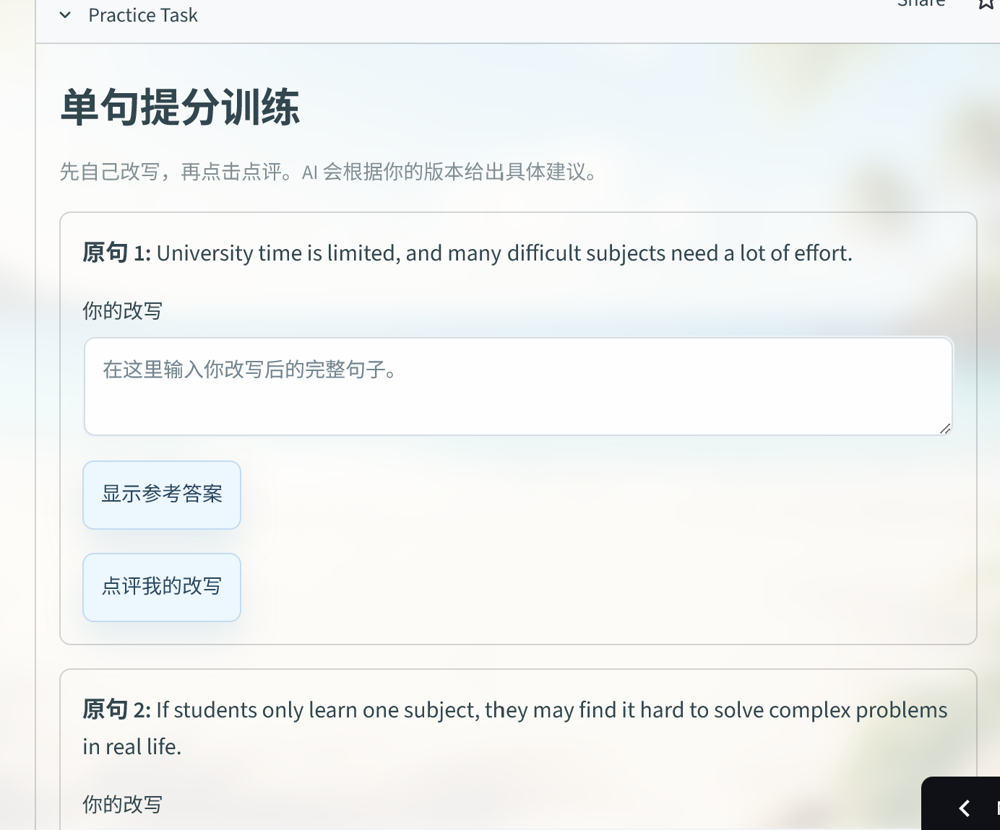
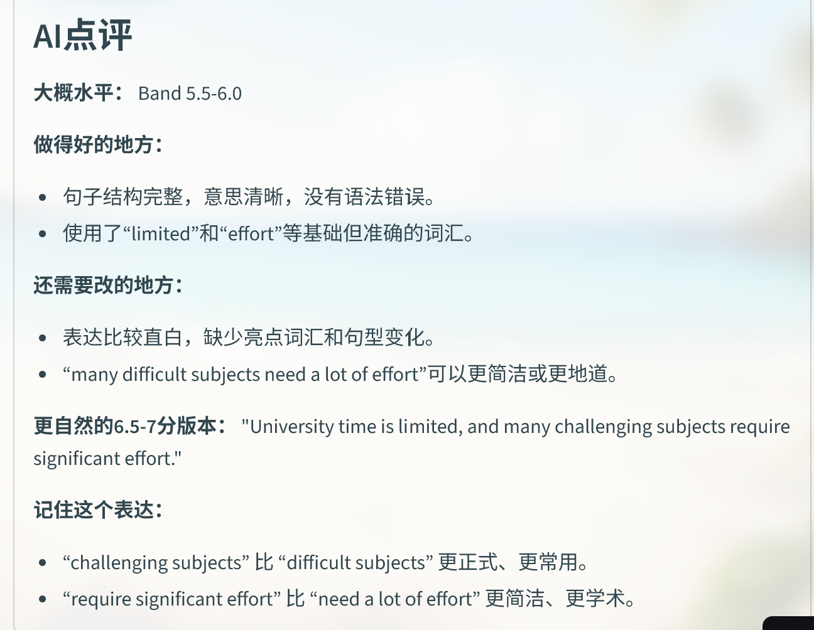
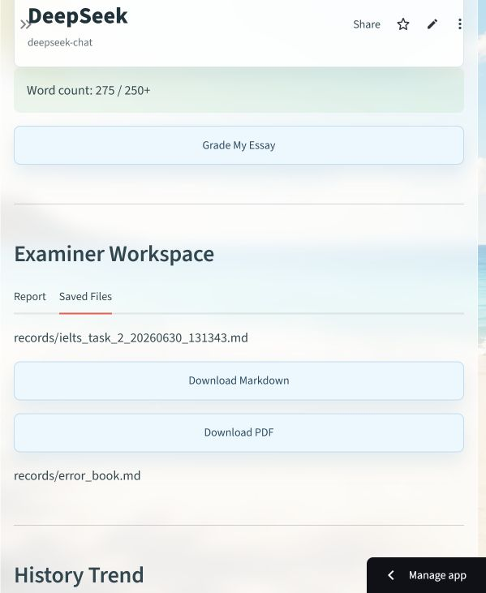
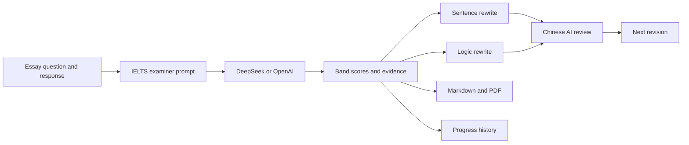

# EssayPilot

### AI-assisted IELTS Writing feedback, revision, and progress tracking

[Open the live app](https://xbz4ydgw2t6cm2ytkh79vq.streamlit.app/) | [View the repository](https://github.com/tornado266/EssayPilot)

EssayPilot is a Streamlit workspace for IELTS Writing Task 2 practice. It turns an essay into criterion-level band estimates, evidence-based feedback, guided rewriting tasks, and portable Markdown/PDF reports.

> EssayPilot is a practice tool, not an official IELTS score report.



## Product Highlights

- **Four-criterion scoring** for Task Response, Coherence and Cohesion, Lexical Resource, and Grammatical Range and Accuracy.
- **Strength-and-weakness evidence** for every criterion, grounded in the student's own writing.
- **Active rewriting practice** at both sentence and paragraph-logic level; students write before receiving feedback.
- **Chinese coaching feedback** that explains what improved, what remains weak, and how to reach Band 6.5+.
- **Band 7 reference material** including improved language, useful expressions, and model rewrites.
- **Markdown and polished PDF export** containing the question, original essay, score, and complete feedback.
- **Progress tracking** with a fixed 3-9 IELTS band chart for recent saved attempts.

## Product Tour

### 1. Score overview

The report begins with the estimated overall band and a separate score card for each IELTS criterion.



### 2. Criterion-level diagnosis

Each IELTS criterion can be expanded independently. The dashboard separates evidence that helps the score from the main issue that limits the next band.



### 3. Full examiner feedback

Detailed feedback is kept in a collapsible report so the dashboard remains easy to scan while preserving the complete analysis.



### 4. A workspace that moves from report to practice

The report, sentence practice, logic check, and score history are separate collapsible areas. Students can focus on one learning task at a time while the progress chart keeps recent attempts comparable on a fixed 3-9 band scale.



### 5. Sentence-level score improvement

EssayPilot extracts weak sentences and asks the student to rewrite them. A reference answer is available, but the main workflow encourages the student to attempt the correction first.



After submission, the AI gives concise Chinese feedback, an estimated level, a more natural Band 6.5-7 version, and reusable language patterns.



### 6. Logic and paragraph development

The logic check targets higher-level problems such as vague claims, shallow explanation, unsupported examples, and weak paragraph progression. Each task includes the original passage and a concrete rewriting constraint.


The comparison step checks whether the rewrite is clearer and closer to Band 6.5+. If the student submits an incomplete rewrite, the system explains why the logic cannot yet be evaluated.


It then converts the weakness into a practical rewrite plan: retain the claim, deepen the explanation, strengthen the example, and reconnect the paragraph to the position.


### 7. Downloadable learning record

Every completed correction can be exported as Markdown or as a styled, bilingual PDF report.



## How It Works



The provider response is parsed defensively. When structured parsing is not possible, EssayPilot keeps the raw examiner report available instead of crashing the interface.

## Feedback Workflow

1. Paste the IELTS Writing Task 2 question.
2. Paste the student's essay and review the word count.
3. Select an AI provider and run the examiner.
4. Review the overall band and four criterion scores.
5. Expand criterion details to compare strengths with the main score-limiting issue.
6. Read the full report for evidence, corrections, and improvement priorities.
7. Rewrite selected weak sentences and request targeted Chinese feedback.
8. Rewrite a key paragraph to improve claim, explanation, example, and progression.
9. Review the comparison feedback and revise again when needed.
10. Export the complete learning record as Markdown or PDF.

## Learning Design

EssayPilot follows a short deliberate-practice loop:

1. **Diagnose:** identify the criterion and the exact sentence or paragraph holding the score back.
2. **Rewrite:** require the student to produce a new version instead of passively reading corrections.
3. **Compare:** evaluate the rewrite against the original and a Band 6.5-7 target.
4. **Transfer:** extract a reusable sentence pattern or paragraph strategy for the next essay.

This keeps the examiner report useful without turning the product into a one-click essay replacement tool.

## Tech Stack

| Layer | Technology |
| --- | --- |
| UI | Streamlit |
| AI providers | DeepSeek and optional OpenAI |
| Provider client | OpenAI Python SDK with configurable base URL |
| Charts | Altair and pandas |
| Report export | ReportLab with an embedded Noto Sans SC font |
| Persistence | Local Markdown and JSON records |

## Quick Start

### 1. Clone the repository

```bash
git clone https://github.com/tornado266/EssayPilot.git
cd EssayPilot
```

### 2. Create and activate a virtual environment

Windows PowerShell:

```powershell
python -m venv .venv
.\.venv\Scripts\Activate.ps1
```

macOS or Linux:

```bash
python -m venv .venv
source .venv/bin/activate
```

### 3. Install dependencies

```bash
pip install -r requirements.txt
```

### 4. Configure a provider

Create a local `.env` file:

```dotenv
DEEPSEEK_API_KEY=your_deepseek_api_key
DEEPSEEK_BASE_URL=https://api.deepseek.com

# Optional
OPENAI_API_KEY=your_openai_api_key
```

The app reads Streamlit Secrets first and falls back to environment variables for local development.

### 5. Run EssayPilot

```bash
streamlit run app.py
```

Then open `http://localhost:8501`.

## Deploy on Streamlit Community Cloud

1. Fork or push the repository to GitHub.
2. Create a new app in [Streamlit Community Cloud](https://share.streamlit.io/).
3. Select the `main` branch and `app.py` entrypoint.
4. Add provider credentials under **App settings > Secrets**:

```toml
DEEPSEEK_API_KEY = "your_deepseek_api_key"
DEEPSEEK_BASE_URL = "https://api.deepseek.com"

# Optional
OPENAI_API_KEY = "your_openai_api_key"
```

Never commit `.env` or `.streamlit/secrets.toml`.

## Project Structure

```text
EssayPilot/
|-- app.py                    # Streamlit presentation layer
|-- requirements.txt
|-- assets/                   # Background and embedded PDF font
|-- screenshots/              # README product screenshots
|-- records/                  # Local correction history
`-- src/
    |-- ai_grader.py          # Provider configuration and requests
    |-- prompts.py            # IELTS examiner and rewrite prompts
    |-- result_parser.py      # Defensive structured parsing
    |-- storage.py            # Markdown, JSON, and PDF exports
    |-- error_book.py         # Error-book generation
    `-- text_utils.py
```

## Data and Deployment Notes

- API keys are loaded from Streamlit Secrets or local environment variables and are never written into report files.
- Records stored on Streamlit Community Cloud are ephemeral and may be cleared when the app restarts.
- AI scoring is probabilistic. Use repeated practice and criterion trends rather than treating one result as an official score.

## License

This repository is intended for learning, portfolio demonstration, and IELTS writing practice. The bundled Noto Sans SC font is distributed under the SIL Open Font License 1.1.
