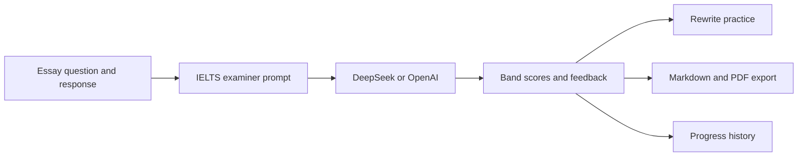

# EssayPilot

### AI-assisted IELTS Writing feedback, revision, and progress tracking

[Open the live app](https://xbz4ydgw2t6cm2ytkh79vq.streamlit.app/) | [View the repository](https://github.com/tornado266/EssayPilot)

EssayPilot is a Streamlit workspace for IELTS Writing Task 2 practice. It turns an essay into criterion-level band estimates, evidence-based feedback, guided rewriting tasks, and portable Markdown/PDF reports.

> EssayPilot is a practice tool, not an official IELTS score report.


## Product Highlights

- **Four-criterion scoring** for Task Response, Coherence and Cohesion, Lexical Resource, and Grammatical Range and Accuracy.
- **Evidence-based diagnosis** grounded in sentences from the student's own essay.
- **Actionable rewriting practice** at both sentence and paragraph-logic level.
- **Band 7 reference material** including improved language, useful expressions, and model rewrites.
- **Markdown and polished PDF export** containing the question, original essay, score, and complete feedback.
- **Progress tracking** with a fixed IELTS band chart for recent saved attempts.

## Product Tour

### 1. Score overview

The report begins with the estimated overall band and a separate score card for each IELTS criterion.


### 2. Full examiner feedback

Detailed feedback is kept in a collapsible report so the dashboard remains easy to scan while preserving the complete analysis.


### 3. Downloadable learning record

Every completed correction can be exported as Markdown or as a styled, bilingual PDF report.


## How It Works



The provider response is parsed defensively. When structured parsing is not possible, EssayPilot keeps the raw examiner report available instead of crashing the interface.

## Feedback Workflow

1. Paste the IELTS Writing Task 2 question.
2. Paste the student's essay and review the word count.
3. Select an AI provider and run the examiner.
4. Review the overall band and four criterion scores.
5. Expand the full report for evidence, corrections, and improvement priorities.
6. Complete the sentence and logic rewriting exercises.
7. Export the complete learning record as Markdown or PDF.

## Tech Stack

| Layer | Technology |
| --- | --- |
| UI | Streamlit |
| AI providers | DeepSeek and optional OpenAI |
| Provider client | OpenAI Python SDK with configurable base URL |
| Charts | Altair and pandas |
| Report export | ReportLab with an embedded Noto Sans SC font |
| Persistence | Local Markdown and JSON records |

## Quick Start

### 1. Clone the repository

```bash
git clone https://github.com/tornado266/EssayPilot.git
cd EssayPilot
```

### 2. Create and activate a virtual environment

Windows PowerShell:

```powershell
python -m venv .venv
.\.venv\Scripts\Activate.ps1
```

macOS or Linux:

```bash
python -m venv .venv
source .venv/bin/activate
```

### 3. Install dependencies

```bash
pip install -r requirements.txt
```

### 4. Configure a provider

Create a local `.env` file:

```dotenv
DEEPSEEK_API_KEY=your_deepseek_api_key
DEEPSEEK_BASE_URL=https://api.deepseek.com

# Optional
OPENAI_API_KEY=your_openai_api_key
```

The app reads Streamlit Secrets first and falls back to environment variables for local development.

### 5. Run EssayPilot

```bash
streamlit run app.py
```

Then open `http://localhost:8501`.

## Deploy on Streamlit Community Cloud

1. Fork or push the repository to GitHub.
2. Create a new app in [Streamlit Community Cloud](https://share.streamlit.io/).
3. Select the `main` branch and `app.py` entrypoint.
4. Add provider credentials under **App settings > Secrets**:

```toml
DEEPSEEK_API_KEY = "your_deepseek_api_key"
DEEPSEEK_BASE_URL = "https://api.deepseek.com"

# Optional
OPENAI_API_KEY = "your_openai_api_key"
```

Never commit `.env` or `.streamlit/secrets.toml`.

## Project Structure

```text
EssayPilot/
|-- app.py                    # Streamlit presentation layer
|-- requirements.txt
|-- assets/                   # Background and embedded PDF font
|-- screenshots/              # README product screenshots
|-- records/                  # Local correction history
`-- src/
    |-- ai_grader.py          # Provider configuration and requests
    |-- prompts.py            # IELTS examiner and rewrite prompts
    |-- result_parser.py      # Defensive structured parsing
    |-- storage.py            # Markdown, JSON, and PDF exports
    |-- error_book.py         # Error-book generation
    `-- text_utils.py
```

## Data and Deployment Notes

- API keys are loaded from Streamlit Secrets or local environment variables and are never written into report files.
- Records stored on Streamlit Community Cloud are ephemeral and may be cleared when the app restarts.
- AI scoring is probabilistic. Use repeated practice and criterion trends rather than treating one result as an official score.

## License

This repository is intended for learning, portfolio demonstration, and IELTS writing practice. The bundled Noto Sans SC font is distributed under the SIL Open Font License 1.1.
